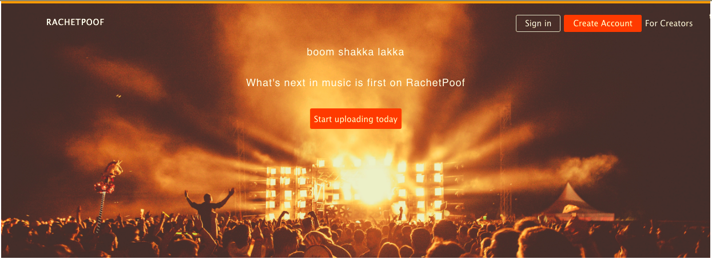
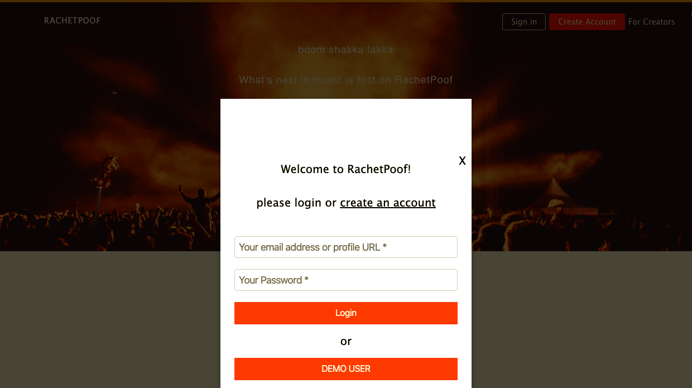
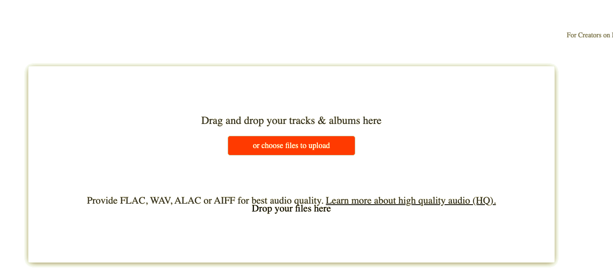

## RatchetPoof, a SoundCloud clone

- [Live on Heruko](https://ratchetpoof.herokuapp.com/)

### Technologies Used

- Ruby on Rails
- Javascript
- React/Redux
- Jbuilder
- PostgreSQL

RachetPoof is a full-stack web application, cloned after the popular music application SoundCloud.

### Features

- User Auth
  Users can sign in or create an account using modals. Once logged in, they are redirected to the discover page. Logged in users are then able to upload tracks to the site.
  

- Track CRUD
  Users can create new tracks. Each track is is created by a user and is stored in the database as the user_id. Users can access this feature directly through "/upload" or can click on upload on the navbar. Tracks will only be saved if both an audio file and artwork are uploaded. Furthermore, the audio file must be an audio mp3 file to pass. 
	