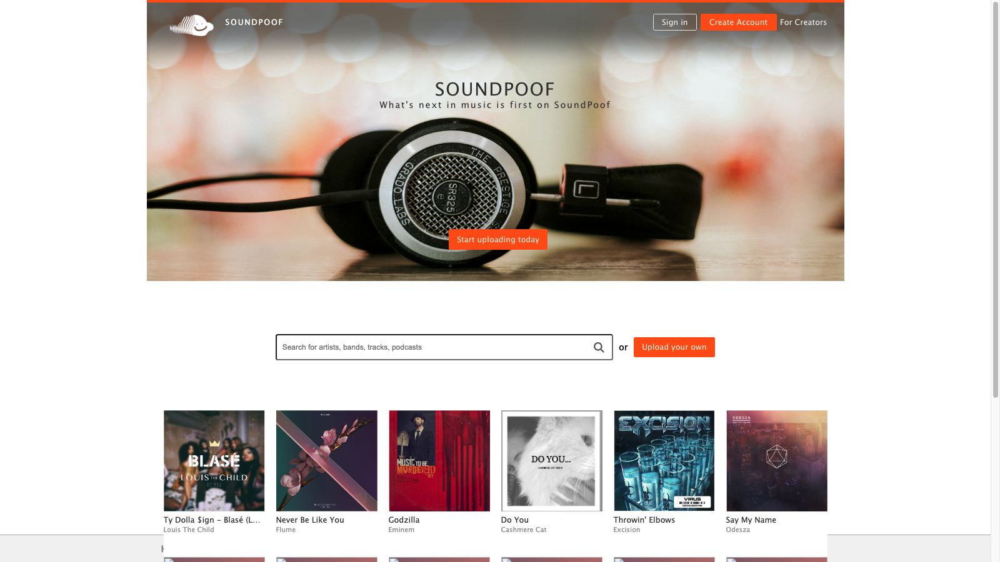

## SoundPoof, a SoundCloud clone

- [Live on Heruko](https://soundpoof.herokuapp.com/)

### Technologies Used

- Ruby on Rails
- Javascript
- React/Redux
- Jbuilder
- PostgreSQL

SoundPoof is a full-stack web application clone of SoundCloud that is built on Rails. SoundPoof features music streamig. Users can search for, list, repost6, and comme4nt on music. Users can also follow other users.

### Features

1. User Auth
2. User Profile w/ likes/reposts/follow
3. Track Upload
4. Track Page & Comments
5. Stream
6. Search
7. Tracklayer
8. WaveForms

- User Auth
  Users can sign in or create an account using modals. Once logged in, they are redirected to the discover page. Logged in users are then able to upload tracks to the site.
  

- Track CRUD
  Users can create new tracks. Each track is is created by a user and is stored in the database as the user_id. Users can access this feature directly through "/upload" or can click on upload on the navbar. Tracks will only be saved if both an audio file and artwork are uploaded. Furthermore, the audio file must be an audio mp3 file to pass. 
	

Future
1. Edit Profile
2. Edit Track
3. Create Playlist
4. Filter Stream to Display Reposts and Posts from Users that the Current User follows

